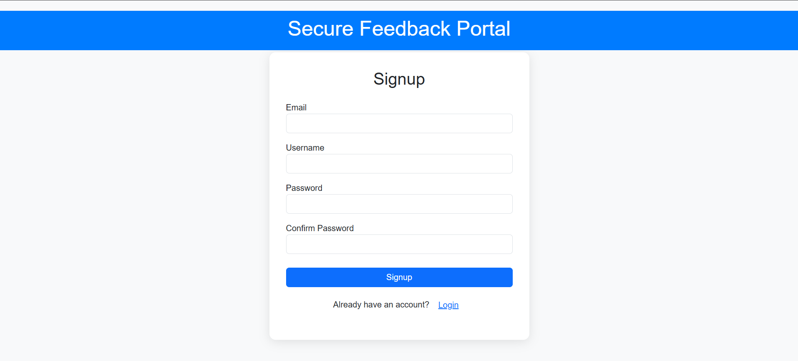
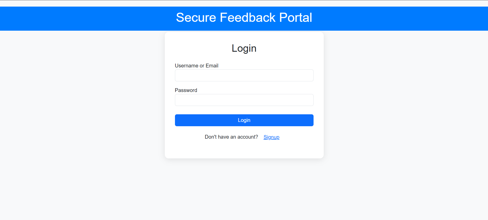
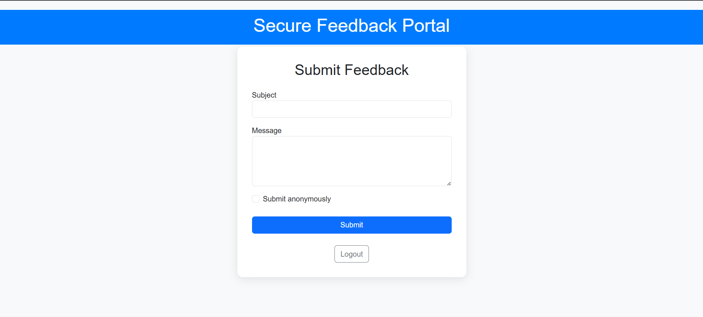
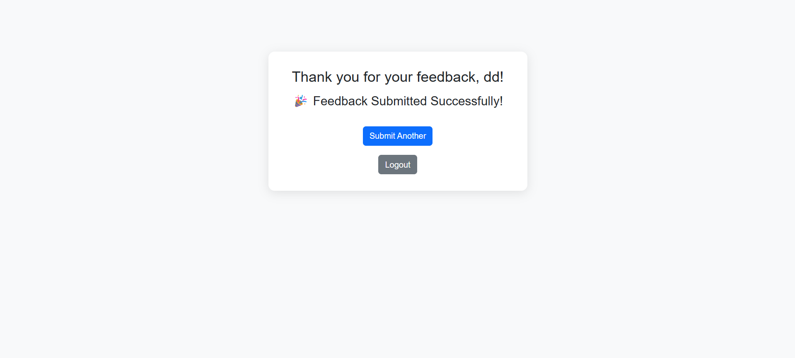

# Secure Feedback Portal

A secure web app for collecting user feedback with authentication & encrypted storage built with Node.js, Express.js & Firebase Firestore.

---

## Features

- User registration and login with email and password
- Passwords are securely hashed before storing in Firebase Firestore
- Users can submit feedback through a secure form
- Admin panel for managing feedback submissions (if applicable)
- Responsive and user-friendly UI using Bootstrap

---

## Screenshots

**Signup Page**  


**Login Page**  


**Feedback Form**  


**Submission Success**  


---

## Installation & Setup

```bash
git clone https://github.com/Dhakshayani-12/Secure-Feedback-Portal.git
cd secure-feedback-portal
npm install
```

- Setup Firebase: Enable Firestore & Email/Password Authentication  
- Add your service account key file in `config/key.js`  
- Start the app with `node app.js`  
- Visit `http://localhost:3000`

---

## Usage

- Signup at `/signup`  
- Login at `/login`  
- Submit feedback securely  
- View confirmation on success page

---

## Technologies

- Node.js
- Express.js
- Firebase Firestore
- Firebase Authentication
- bcrypt (for password hashing)
- EJS templating engine
- Bootstrap 5

---


## Contact

Created by Dhakshayani
